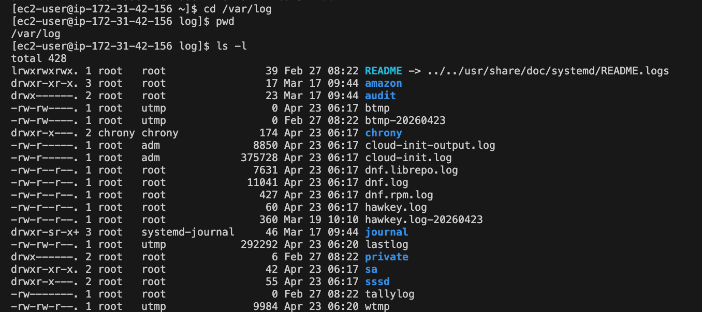
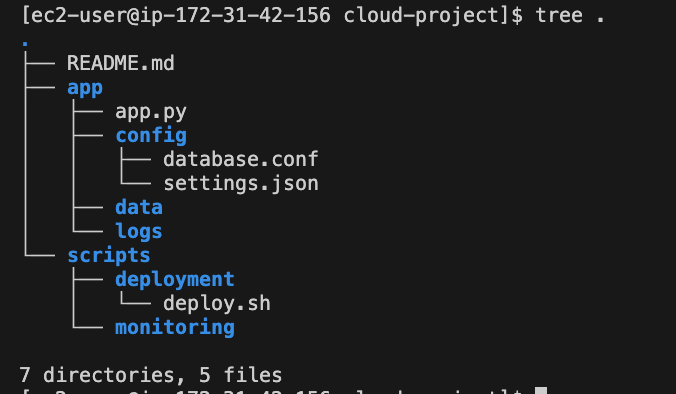
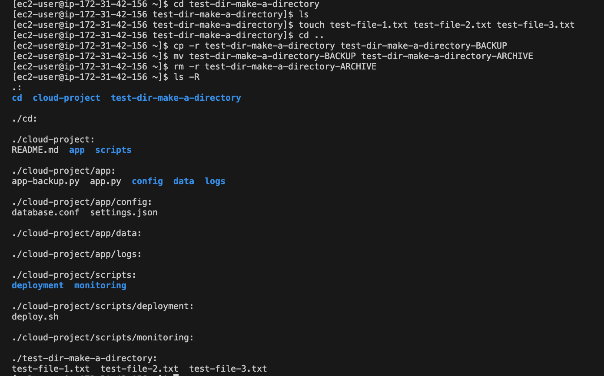
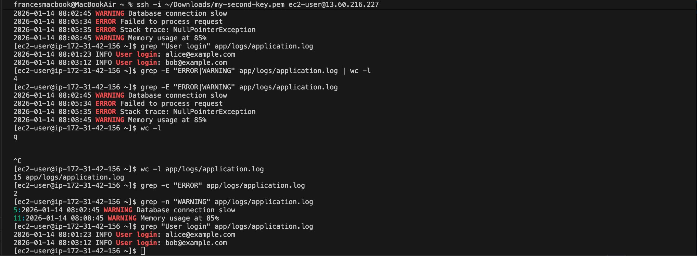
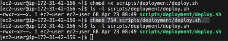
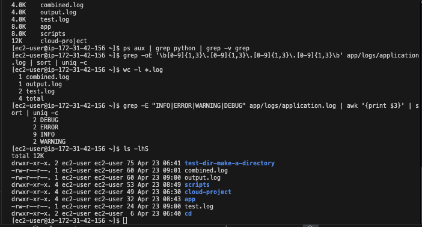
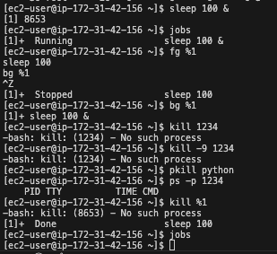
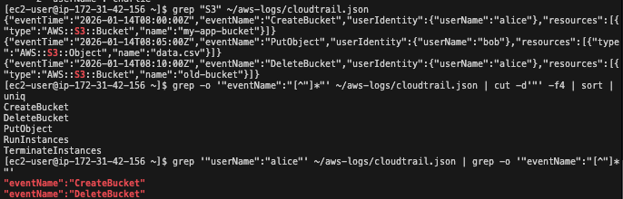
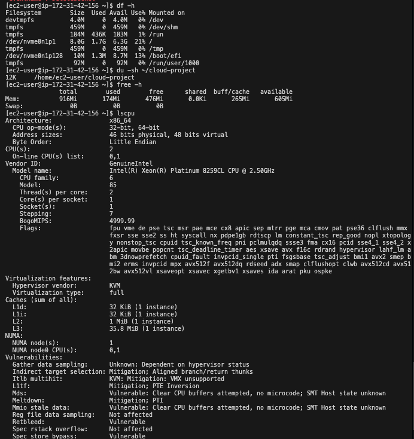

# Lab Solution: Linux Command Line Essentials

**Student Name:** ___________________________  
**Date:** ___________________________  
**Environment Used:** ☐ EC2 ☐ Local Linux ☐ WSL ☐ macOS ☐ Cloud9

---

## Part 1: Environment Setup

### Connection Information

**Command used to connect:**
```bash
whoami
hostname
uname -a
pwd
```

**Output of `whoami`:**
```
ec2-user
```

**Output of `pwd`:**
```
/home/ec2-user
```

**Output of `uname -a`:**
```
Linux ip-172-31-42-156.eu-north-1.compute.internal 6.1.163-186.299.amzn2023.x86_64 #1 SMP PREEMPT_DYNAMIC Tue Feb 24 16:35:42 UTC 2026 x86_64 x86_64 x86_64 GNU/Linux
```

---

## Part 2: Navigation Practice

### Task: Navigate to /var/log and back

**Commands executed:**
```bash
# Navigate to /var/log
cd /var/log

# List contents
total 428
lrwxrwxrwx. 1 root   root                39 Feb 27 08:22 README -> ../../usr/share/doc/systemd/README.logs
drwxr-xr-x. 3 root   root                17 Mar 17 09:44 amazon
drwx------. 2 root   root                23 Mar 17 09:44 audit
-rw-rw----. 1 root   utmp                 0 Apr 23 06:17 btmp
-rw-rw----. 1 root   utmp                 0 Feb 27 08:22 btmp-20260423
drwxr-x---. 2 chrony chrony             174 Apr 23 06:17 chrony
-rw-r-----. 1 root   adm               8850 Apr 23 06:17 cloud-init-output.log
-rw-r-----. 1 root   adm             375728 Apr 23 06:17 cloud-init.log
-rw-r--r--. 1 root   root              7631 Apr 23 06:17 dnf.librepo.log
-rw-r--r--. 1 root   root             11041 Apr 23 06:17 dnf.log
-rw-r--r--. 1 root   root               427 Apr 23 06:17 dnf.rpm.log
-rw-r--r--. 1 root   root                60 Apr 23 06:17 hawkey.log
-rw-r--r--. 1 root   root               360 Mar 19 10:10 hawkey.log-20260423
drwxr-sr-x+ 3 root   systemd-journal     46 Mar 17 09:44 journal
-rw-rw-r--. 1 root   utmp            292292 Apr 23 06:20 lastlog
drwx------. 2 root   root                 6 Feb 27 08:22 private
drwxr-xr-x. 2 root   root                42 Apr 23 06:17 sa
drwxr-x---. 2 root   root                55 Apr 23 06:17 sssd
-rw-------. 1 root   root                 0 Feb 27 08:22 tallylog
-rw-rw-r--. 1 root   utmp              9984 Apr 23 06:20 wtmp

# Return to home directory
cd ~
```

**Screenshot 1: /var/log directory listing**


---

## Part 3: Directory Structure Creation

### Project Structure

**Commands to create directory structure:**
```bash
# Create cloud-project directory
mkdir cloud-project

# Create nested directories
mkdir -p app/config
mkdir -p app/logs
mkdir -p app/data
mkdir -p scripts/deployment
mkdir -p scripts/monitoring

# Create files


```

**Screenshot 2: Project structure (tree or ls -R output)**


---

## Part 4: File Operations

### Copy, Move, Delete Practice

**Commands for test directory task:**
```bash
# Create test directory with files
mkdir test-dir-make-a-directory

# Make backup copy
cp -r test-dir-make-a-directory test-dir-make-a-directory-BACKUP

# Rename backup
 mv test-dir-make-a-directory-BACKUP test-dir-make-a-directory-ARCHIVE

# Delete backup
rm -r test-dir-make-a-directory-ARCHIVE

# Verify final state
ls -R
```

**Screenshot 3: File operations results**


---

## Part 5: Viewing File Contents

### Log File Analysis

**Output of last 3 lines:**
```
2026-01-14 08:15:30 INFO Backup completed successfully
2026-01-14 08:20:00 DEBUG Garbage collection triggered
2026-01-14 08:25:15 INFO Health check: OK
```

**Command used:**
```bash
tail -n 3 app/logs/application.log
```

---

## Part 6: Searching with grep

### Task: Search log file

**1. Count ERROR messages:**
```bash
# Command:
grep -c "ERROR" app/logs/application.log
# Output:
2
```

**2. Find WARNING messages with line numbers:**
```bash
# Command:
grep -n "WARNING" app/logs/application.log
# Output:
5:2026-01-14 08:02:45 WARNING Database connection slow
11:2026-01-14 08:08:45 WARNING Memory usage at 85%
```

**3. Extract user login events:**
```bash
# Command:
grep "User login" app/logs/application.log
# Output:
2026-01-14 08:01:23 INFO User login: alice@example.com
2026-01-14 08:03:12 INFO User login: bob@example.com
```

**Screenshot 4: grep search results**


---

## Part 7: File Permissions

### Task: Create and secure script

**Commands executed:**
```bash
# Create test script
[ec2-user@ip-172-31-42-156 ~]$ chmod +x scripts/deployment/deploy.sh
[ec2-user@ip-172-31-42-156 ~]$ ls -l scripts/deployment/deploy.sh
# Check initial permissions
ls -l scripts/deployment/deploy.sh

# Make executable for owner only
chmod 754 scripts/deployment/deploy.sh

# Verify permissions
ls -l scripts/deployment/deploy.sh

# Output:
-rwxr-xr--. 1 ec2-user ec2-user 68 Apr 23 08:49 scripts/deployment/deploy.sh
```

**Initial permissions:** Owner rwxr read+write+execute, group x execute only, others x execute only

**Final permissions:** Owner rwx read+write+execute, group xr execute+read, others none

**Screenshot 5: Permission changes**


### Secure Backup Script

**Script content:**
```bash
cat > scripts/deployment/deploy.sh << 'EOF'
#!/bin/bash
echo "Deploying application..."
# Deployment logic here
EOF
```

**Permissions set:**
```bash
# Command:
chmod 750 scripts/deployment/deploy.sh
# Result (ls -l):
-rwxr-x---. 1 ec2-user ec2-user 68 Apr 23 08:49 scripts/deployment/deploy.sh
```

---

## Part 9: Pipes and Redirects

### Task: Command chaining

**1. Count total lines in all .log files:**
```bash
# Command:
wc -l *.log
# Result:
1 combined.log
  1 output.log
  2 test.log
  4 total
```

**2. Find unique log levels and count:**
```bash
# Command:
grep -E "INFO|ERROR|WARNING|DEBUG" app/logs/application.log | awk '{print $3}' | sort | uniq -c
# Result:
      2 DEBUG
      2 ERROR
      9 INFO
      2 WARNING
```

**3. List files sorted by size:**
```bash
# Command:
ls -lhS
# Result:
drwxr-xr-x. 2 ec2-user ec2-user 75 Apr 23 06:41 test-dir-make-a-directory
-rw-r--r--. 1 ec2-user ec2-user 60 Apr 23 09:01 combined.log
-rw-r--r--. 1 ec2-user ec2-user 60 Apr 23 09:00 output.log
drwxr-xr-x. 4 ec2-user ec2-user 53 Apr 23 08:49 scripts
drwxr-xr-x. 4 ec2-user ec2-user 49 Apr 23 06:30 cloud-project
drwxr-xr-x. 4 ec2-user ec2-user 32 Apr 23 08:43 app
-rw-r--r--. 1 ec2-user ec2-user 24 Apr 23 09:00 test.log
drwxr-xr-x. 2 ec2-user ec2-user  6 Apr 23 06:40 cd
```

**Screenshot 6: Pipes and redirects output**


---

## Part 9: Process Management

### Task: Background process

**1. Start long-running command in background:**
```bash
# Command:
sleep 100 &
# Output (job number):
[1] 8653
```

**2. List all jobs:**
```bash
# Command:
jobs
# Output:
[1]+  Running                 sleep 100 &
```

**3. Kill the process:**
```bash
# Command:
kill %1
# Verification:
jobs
```

**Screenshot 7: Process management**


---

## Part 10: Cloud Engineering Scenarios

### CloudTrail Log Analysis

**1. Events per user:**
```bash
# Command:
grep -o '"userName":"[^"]*"' ~/aws-logs/cloudtrail.json | sort | uniq -c
# Result:
      2 "userName":"alice"
      1 "userName":"bob"
      2 "userName":"charlie"
```

**2. EC2 operations:**
```bash
# Command:
grep -o '"eventName":"[^"]*"' ~/aws-logs/cloudtrail.json | cut -d'"' -f4 | sort | uniq
# Result:
uniq
CreateBucket
DeleteBucket
PutObject
RunInstances
TerminateInstances
```

**3. Unique event types:**
```bash
# Command:
grep '"userName":"alice"' ~/aws-logs/cloudtrail.json | grep -o '"eventName":"[^"]*"'
# Result:
"eventName":"CreateBucket"
"eventName":"DeleteBucket"
```

**Screenshot 8: CloudTrail analysis**


### System Monitoring

**1. Disk space:**
```bash
# Command: df -h

# Total space: 8.0G
# Used: 1.7G
# Available: 6.3G 
# Usage %: 21%
```

**2. Available memory:**
```bash
# Command: free -h

# Total: 916Mi 
# Used: 174Mi 
# Free: 476Mi 
```

**3. CPU cores:**
```bash
# Command: lscpu

# CPU(s): 2
# Model: 85
```

**Screenshot 9: System resources**


---

## Command Cheat Sheet (Your Most Used)

**List your 10 most-used commands from this lab:**

1. ls -la
2. cd
3. grep
4. ps
5. cat
6. echo
7. mkdir
8. touch
9. cp
10. cat

---

## Reflection Questions

### 1. How do file permissions enhance security in cloud environments?

**Your answer:**
```
It enhances security by limiting access to unnecessary data to the user. In this way, root or admin can have control over who can access what to prevent accidents. 
```

### 2. Why is piping commands together more efficient than intermediate files?

**Your answer:**
```
1. enhances visual appearance.
2. faster performance
3. cleaner workflow
4. real-time processing
```

### 3. Describe a real-world scenario where you'd use `tail -f`.

**Your answer:**
```
This could be when troubleshooting a user login attempt error. Errors could be see live on log and show what were the actions used. 
```

### 4. What's the difference between killing with `kill` vs `kill -9`?

**Your answer:**
```
kill is basically quit/exit an app on macbook 
kill -9 is force quit
```

### 5. How does Linux CLI proficiency help with AWS CLI usage?

**Your answer:**
```
Commands are quite the same. Automation and scripting seems to be powerful with Linux and permissions and environment are supported by Linux.
```

---

## Troubleshooting Log

**Did you encounter any issues?** (Yes/No): No

**If yes, document:**

| Issue | Commands Tried | Solution | Time Spent |
|-------|---------------|----------|------------|
|       |               |          |            |
|       |               |          |            |
|       |               |          |            |

---

## Cleanup Confirmation

- [x] Removed ~/cloud-project directory
- [x] Removed ~/aws-logs directory
- [x] Verified no leftover files

**Cleanup commands:**
```bash
rm -rf cloud-project
rm -rf aws-logs
```

---

## Self-Assessment

**Rate your confidence (1-5, where 5 is expert):**

| Skill | Before Lab | After Lab | Notes |
|-------|-----------|-----------|-------|
| Filesystem navigation | 4/5 | 4/5 | |
| File manipulation | __3/5 | 4/5 | |
| Viewing/searching files | 3/5 | 4/5 | |
| File permissions | 2/5 | 3/5 | |
| Pipes and redirects | 1/5 | 2/5 | |
| Process management | 2/5 | 3/5 | |
| Log analysis | 2/5 | 3/5 | |

---

## Bonus Challenges Completed

- [ ] Explored `awk` for text processing
- [ ] Created a shell script with multiple commands
- [ ] Used `find` with complex criteria
- [ ] Practiced `sed` for text replacement
- [ ] Set up custom bash aliases

**Bonus notes:**
```
_____________________________________________________________
_____________________________________________________________
_____________________________________________________________
```

---

## Instructor Verification

**Instructor Name:** ___________________________

**Date Reviewed:** ___________________________

**All tasks completed:** ☐ Yes ☐ No

**Comments:**
```
_____________________________________________________________
_____________________________________________________________
_____________________________________________________________
```

**Grade/Status:** ___________________________

---

**Lab Status:** ☐ Complete ☐ Needs Revision

**Total Time Spent:** ________ minutes

**Submission Date:** ___________________________
